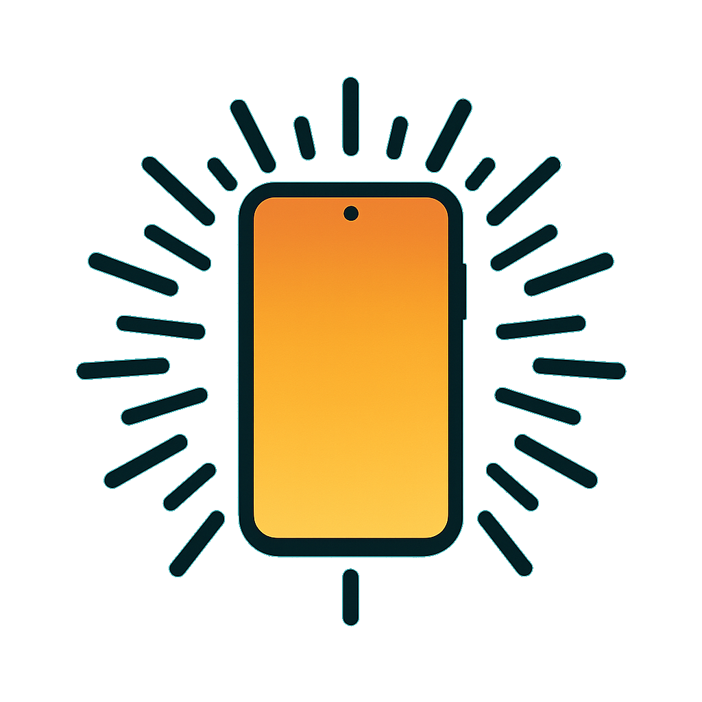

# DisplayTorch

A minimalist Android flashlight that uses the screen itself as the light
source. No camera flash, no permissions, no ads, no tracking.

<p align="center">
  
</p>

## Features

- **Screen as torch** — the whole display becomes a configurable light.
- **Five brightness steps** — tap to cycle through them.
- **White / red mode** — two-finger tap toggles between a white light and a
  dim red light (good for preserving night vision).
- **Volume keys** — Volume Up / Down step through brightness levels.
- **Edit mode** — long-press to enter edit mode, then use Volume Up / Down to
  fine-tune the current step. Changes persist across launches.
- **Keeps screen on** while the app is in the foreground.

## Usage

| Gesture | Action |
| --- | --- |
| Single tap | Next brightness step |
| Two-finger tap | Toggle white / red |
| Long press | Enter / exit edit mode |
| Volume Up / Down | Step brightness (or fine-tune in edit mode) |

## Building

Requires Android Studio or the Android SDK with `ANDROID_HOME` set.

```sh
./gradlew assembleDebug        # debug APK
./gradlew assembleRelease      # release APK (needs signing config)
```

The output APK ends up under `app/build/outputs/apk/`.

## Requirements

- Android 7.0 (API 24) or newer.

## License

[0BSD](LICENSE) — do whatever you want with it.
