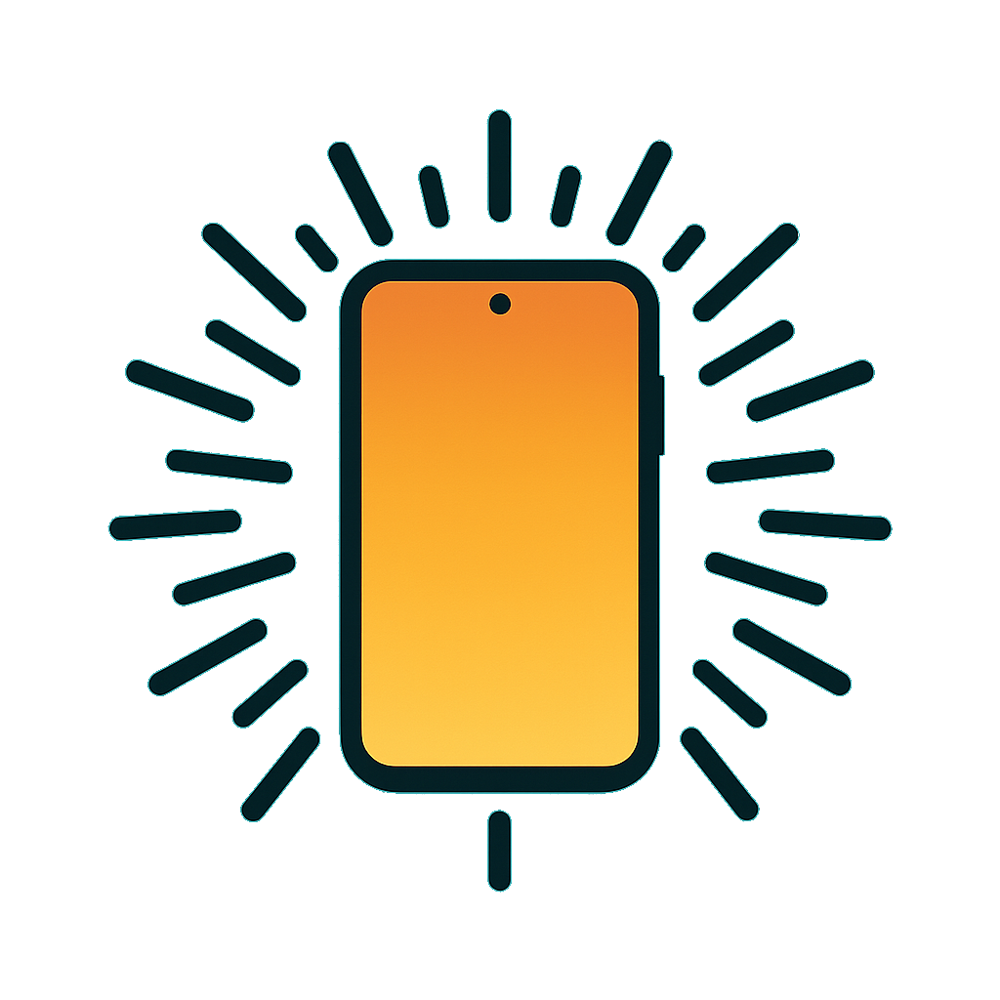

# DisplayTorch

A minimalist Android flashlight that uses the screen itself as the light
source. No camera flash, no permissions beyond internet access for the ad
banner, no analytics or tracking of its own.

<p align="center">
  
</p>

## Features

- **Screen as torch** — the whole display becomes a configurable light.
- **Five brightness steps** — tap to cycle through them.
- **White / red mode** — two-finger tap toggles between a white light and a
  dim red light (good for preserving night vision).
- **Volume keys** — Volume Up / Down step through brightness levels.
- **Edit mode** — long-press to enter edit mode, then use Volume Up / Down to
  fine-tune the current step. Changes persist across launches.
- **Quick Settings tile** — add the "Torch" tile to switch the light on from
  anywhere, including the lock screen.
- **First-run tutorial** — the hidden gestures are introduced once on first
  launch and can be reopened any time from the edit-mode menu.
- **Keeps screen on** while the app is in the foreground.

## Usage

| Gesture | Action |
| --- | --- |
| Single tap | Next brightness step |
| Two-finger tap | Toggle white / red |
| Long press | Enter / exit edit mode |
| Volume Up / Down | Step brightness (or fine-tune in edit mode) |

Edit mode shows a `⋮` button in the top-end corner with these entries:

| Entry | Action |
| --- | --- |
| How it works | Reopen the gesture tutorial |
| Reset to defaults | Restore all five brightness steps |
| Remove ads | One-time in-app purchase that removes the banner |
| Privacy options | Change the ad-consent choice (shown only where regulation requires it) |

## Free, ad-supported

The app shows a small banner at the bottom of the screen (Google AdMob). A
one-time "Remove ads" purchase through Google Play Billing removes it for
good. The app itself collects no data; see the
[privacy policy](docs/privacy-policy.md) for what the Google services involved
may process.

## Building

Requires Android Studio or the Android SDK with `ANDROID_HOME` set.

```sh
./gradlew assembleDebug        # debug APK (test ad IDs)
./gradlew assembleRelease      # release APK (needs signing config and real ad IDs)
./gradlew test                 # unit tests
```

The output APK ends up under `app/build/outputs/apk/`.

## Requirements

- Android 8.0 (API 26) or newer.

## License

[0BSD](LICENSE) — do whatever you want with it.
